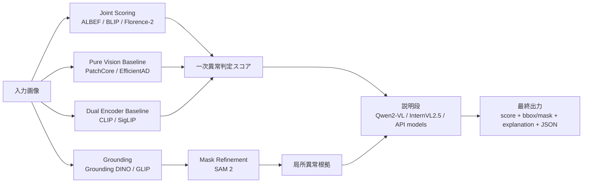

# 画像異常判定システムのためのVLM・ビジョンモデル調査報告

## エグゼクティブサマリー

画像ベースの異常判定を、**言語付きの説明生成**ではなく、まず**画像とテキストを同時入力して相関・整合性をスコア化できる系統**から組む、という方針はかなり妥当です。今回の一次調査では、ユーザーの優先条件どおり、**クロスエンコーダー寄りの画像テキストマッチング系・言語条件付きグラウンディング系**を最重視すると、実験として筋が良いことが確認できました。具体的には、**ALBEF、BLIP、GLIP、Grounding DINO、Florence-2** は、画像とテキストの相互作用を比較的明示的に扱えるため、**「この質問文に照らして異常か」「この部位が異常か」**をスコア化・局所化しやすい候補です。一方、**CLIP / SigLIP** のような dual-encoder は高速・実装容易な一次ベースラインとして非常に有用ですが、微妙な局所異常や文脈依存の論理異常では、より密な融合を使う系に劣る可能性があります。さらに、異常専用の転用先としては **WinCLIP、AnomalyCLIP、CLIP-AD** が有力です。 citeturn47academia0turn40view2turn37academia1turn55view1turn41view1turn35academia0turn36academia0turn56academia1turn32view2

逆に、**Qwen2-VL、InternVL2.5、LLaVA、BLIP-2、InstructBLIP** のような生成系VLMや、**OpenAI / Gemini / Claude** のAPIモデルは、**説明、異常理由の言語化、比較観察、VQA、構造化出力、ツール連携**には強い一方で、産業異常判定の**一次意思決定器**としてそのまま使うのは危険です。特に **MMAD** は、工業異常検査におけるMLLM評価を体系化したベンチマークで、商用モデルが最良でも **GPT-4o系平均正答率 74.9%** にとどまり、「工業要件にはなお不足」と結論づけています。したがって、生成系は**第ニ段の説明器・レビューア・異常候補の再判定器**として入れるのが現実的です。 citeturn22academia3turn24academia0turn20view0turn42view0turn49academia0turn39view4turn58view0turn59view1

ベンチマークは、**MVTec AD、VisA、MVTec LOCO AD** を最初の共通土台にしつつ、**MVTec AD 2** で難度を上げ、必要に応じて **ADNet** や **Kaputt** を加えてスケール・分布変化・高ばらつき条件を評価する設計が良いです。理由は、既存の MVTec AD と VisA では飽和傾向が指摘されており、AD 2 は照明変化や小欠陥などの難条件を追加し、ADNet は 380 カテゴリと構造化テキスト記述を備えて、将来のマルチモーダル異常検知に向くからです。 citeturn27view0turn28view0turn30view0turn31view1turn26academia0turn26academia2

結論として、最も再現性が高い実験順は、**Pure Vision異常ベースライン → CLIP/SigLIP埋め込み基線 → ALBEF/BLIP/Florence-2/Grounding DINO のスコア型実験 → WinCLIP/AnomalyCLIP/CLIP-AD → 生成系VLM/APIを説明段に追加**、です。これだと、精度、局所化、説明性、運用費用、再現性を個別に切り分けられます。 citeturn33academia2turn16academia0turn35academia0turn36academia0turn47academia0turn40view2turn41view1turn55view1turn56academia1turn32view2turn49academia0

## 調査範囲と判断軸

本レポートでは、ユーザーが想定している異常判定の使い方を、実験計画上わかりやすいように以下の **A–I パターン** に整理します。これは論文の正式分類ではなく、本調査の実装指向の整理です。

| パターン | 意味 | 典型出力 | 主に向くモデル系 |
|---|---|---|---|
| A | 画像全体の正常/異常判定 | Yes/No, 二値スコア | CLIP系, ALBEF/BLIP ITM, WinCLIP, AnomalyCLIP |
| B | 質問文との整合性スコア | similarity / matching score | ALBEF, BLIP, CLIP, SigLIP, CLIP-AD |
| C | 異常タイプ分類 | defect label / attribute | CLIP系, Florence-2, Qwen2-VL |
| D | 異常部位の言語条件付き検出 | BBox | GLIP, Grounding DINO, Florence-2, Gemini |
| E | 異常領域の局所化 | Mask / heatmap / saliency | WinCLIP, AnomalyCLIP, CLIP-AD, SAM 2補助 |
| F | 正常参照画像との比較 | pairwise score / text diff | Claude, OpenAI, Gemini, Qwen2-VL |
| G | 異常理由の説明 | text rationale | BLIP-2, InstructBLIP, Qwen2-VL, InternVL2.5, API系 |
| H | 監査向け構造化出力 | JSON / schema | OpenAI, Gemini, Florence-2 |
| I | 画像＋外部ツールの検査ワークフロー | tool traces / agent outputs | OpenAI Agents, Gemini agent系, Claude tool use |

ユーザーが追加したタスク群は、異常検知の観点では大きく四つにまとめられます。**VQA、キャプショニング、ビジュアルリーズニング、インストラクションフォローイング、ビジュアルチャット**は主に A/C/G に効きます。**クロスモーダルマッチング、リトリーバル、Image-Text Matching** は B/F に直結します。**グラウンディング、referring expression、Detection+Language、Segmentation+Language、属性認識、structured V-L、マルチモーダルIE** は D/E/H の中核です。さらに **visual tool use / agent task** は、実運用の再検査やレビュー工程に相当します。これらを単一モデルで広く扱える代表例として、**Florence-2、Grounding DINO、X-Decoder、SEEM、Qwen2-VL、InternVL2.5、OpenAI/Gemini/Claude の vision API** が確認できます。 citeturn41view1turn37academia0turn37academia2turn20view0turn42view0turn39view4turn58view0turn59view1

判断軸としては、**精度だけでなく、スコア化しやすさ、局所異常への強さ、論理異常への強さ、説明性、実装容易性、ライセンス、商用可否、再現性、コスト/レイテンシ**を分けて見る必要があります。特に工業検査では、画像キャプションの自然さよりも、**安定した閾値設計**、**どこが異常かの根拠**、**モデルの更新可能性**のほうが重要です。MVTec LOCO AD のような論理異常データセットは、単純なパッチ距離ベースでは難しく、よりグローバルな文脈理解が要ることを示しています。 citeturn30view0turn49academia0turn31view1

## 主要モデルと論文比較

### 優先度が高いスコアリング・グラウンディング系

詳細な書誌情報は末尾の NotebookLM 用表にまとめています。ここでは、**異常判定に使う実験アームとしての実用性**を中心に比較します。

| モデル | 年 | 分類 | 融合方式 | 主対応タスク | 代表出力 | 異常検知での使い方 | 代表指標 | 直接異常評価 | OSS/API・ライセンス | 実装/商用メモ | 優先度 | 出典 |
|---|---:|---|---|---|---|---|---|---|---|---|---|---|
| CLIP | 2021 | dual-encoder / retrieval / ITM基線 | 画像エンコーダ + テキストエンコーダ | zero-shot分類, retrieval, ITM類似度 | cosine similarity | A/B/F の最速ベースライン。正常/異常プロンプトを並べてスコア比較 | ImageNet zero-shotでResNet-50相当; anomaly数値は未確認 | 間接 | OSS, MIT | 実装が最も簡単。埋め込み再利用しやすい | A | citeturn35academia0turn51view0 |
| SigLIP | 2023 | dual-encoder / retrieval | dual encoder + sigmoid loss | retrieval, zero-shot分類 | similarity | CLIP代替の強ベースライン。高速で運用容易 | ImageNet zero-shot 84.5% | 間接 | OSS, Apache-2.0相当の公式実装系 | Google公式実装は big_vision。 anomaly用には追加設計が必要 | A | citeturn36academia0turn52view0 |
| ALBEF | 2021 | cross-encoder寄り / ITM / VQA / grounding | Align-before-Fuse + cross-modal attention | VQA, retrieval, grounding, NLVR2 | match score, text, grounding | **質問文ごとの異常スコア**を作りやすい。B/Dに強い | VQA +2.37pt, NLVR2 +3.84pt, retrievalで大規模事前学習法を上回る | 間接 | OSS, BSD-3-Clause | 研究実装は古いが still useful。LAVIS経由が現実的 | A | citeturn47academia0turn44view1 |
| BLIP | 2022 | ITM + captioning + VQA | unified encoder-decoder/ITM | retrieval, captioning, VQA, NLVR2 | text, ITM, features | **説明生成とITMの両取り**。A/B/G の比較軸に良い | retrieval +2.7 R@1, captioning +2.8 CIDEr, VQA +1.6 | 間接 | OSS, BSD-3-Clause | 公式repoは deprecated。実運用は LAVIS を推奨 | A | citeturn40view2turn43view0turn43view2 |
| GLIP | 2021 | grounded language-image pretraining | language-conditioned detector | grounding, detection, open-vocab det. | BBox, label | **異常部位候補を語彙条件付きで拾う** Dに有効 | COCO 49.8 AP zero-shot, 60.8/61.5 AP fine-tuned | 間接 | OSS, GitHubあり | 局所異常や部品欠損の開語彙検出に向く | A | citeturn37academia1 |
| Grounding DINO | 2023 | open-set grounding / detection+language | detector + text conditioning | grounding, open-set detection | BBox, phrase-grounded boxes | **異常候補部位の一次探索**。質問文を defect phrase にする使い方が有望 | COCO zero-shot 52.5 AP, fine-tune 63.0 AP | 間接 | OSS, Apache-2.0 | Grounded-SAM/SAM2連携が非常に実用的 | A | citeturn55view1turn55view2 |
| Florence-2 | 2023 | generalist vision foundation / seq2seq | prompt-based seq2seq | caption, grounding, OD, OCR, dense region caption | text, BBox, OCR, confidence | **一つで B/D/G/H を試しやすい**。局所説明にも強い | COCO Det mAP 37.5, Flickr30k R@1 84.4, RefCOCO val 56.3 | 間接 | OSS, MIT | 多機能で実験効率が高い。score付きODも可能 | A | citeturn48academia0turn41view1 |
| WinCLIP | 2023 | anomaly-specific / CLIP adaptation | window-based CLIP scoring | zero/few-shot anomaly cls/seg | anomaly score, map | **CLIP系の異常専用基線**。A/E の重要比較対象 | MVTec/VisAで評価、数値は本調査では未確認 | 直接 | 再現repo確認, GPL-3.0, ただし unofficial | 公式実装はこの調査では未確認。再現repoは有用 | A | citeturn34view1turn34view0 |
| AnomalyCLIP | 2024 | anomaly-specific / object-agnostic prompts | CLIP + learned anomaly prompts | zero-shot anomaly det./seg | anomaly score, heatmap | **汎用異常性の学習**。物体依存を弱める発想が強い | 17 real-world AD datasetsで superior; 数値は未確認 | 直接 | OSS, MIT相当repo確認 | 産業だけでなく医療にもまたがる点が強み | A | citeturn32view2turn21view0turn32view1 |
| CLIP-AD | 2023 | anomaly-specific / language-guided staged dual-path | multi-level CLIP adaptation | zero-shot anomaly det./seg | anomaly score, maps | **WinCLIPよりスコア改善が明示**。B/E に有効 | MVTec-ADでWinCLIP比 +4.2/+10.7 F1-max/PRO、SDP+で +8.3/+20.5 | 直接 | GitHub未確認 | 研究的には有力。再現資産の確認が次段階 | A | citeturn56academia1 |

この表を要約すると、**「異常かどうか」を安定スコアに落とし込む」なら ALBEF / BLIP / Florence-2、「どこが異常か」まで含めるなら Grounding DINO / GLIP / Florence-2、「異常専用のゼロショット基線」なら WinCLIP / AnomalyCLIP / CLIP-AD** がもっとも価値があります。**CLIP / SigLIP** は外せない基線ですが、最終器よりも「比較対象」や「軽量候補」としての意味合いが強いです。 citeturn47academia0turn40view2turn41view1turn37academia1turn55view1turn56academia1turn32view2

### 生成系VLMとAPI系モデル

| モデル | 年 | 分類 | 融合方式 | 主対応タスク | 代表出力 | 異常検知での使い方 | 代表指標 | 直接異常評価 | OSS/API・ライセンス | 実装/商用メモ | 優先度 | 出典 |
|---|---:|---|---|---|---|---|---|---|---|---|---|---|
| BLIP-2 | 2023 | generative VLM | frozen image encoder + Q-Former + LLM | captioning, VQA, instructed generation | text | G中心。説明生成や比較観察に強い | zero-shot VQAv2 65.0 vs Flamingo 56.3, NoCaps 121.6 CIDEr | 間接 | OSS, LAVIS経由 | scorer単独より説明器・二段目判定器向き | B | citeturn54view0 |
| InstructBLIP | 2023 | instruction-following VLM | instruction-aware Query Transformer | VQA, captioning, reasoning, held-out task generalization | text | G/Hに強い。異常の説明文生成、監査コメント生成向き | ScienceQA 90.7% | 間接 | OSS, LAVIS | promptの設計自由度が高い | B | citeturn40view1turn54view0 |
| LLaVA-1.5 | 2023 | visual chat / instruction tuning | CLIP-ViT + MLP projector + LLM | visual chat, captioning, reasoning, OCR系VQA | text | G/F。正常品と異常品の比較説明に使いやすい | GPT-4相対 85.1%、ScienceQA 90.92 / 92.53 with GPT-4 judge | 間接 | OSSだが研究用途制約が強い | 商用・本番用途はライセンス確認必須 | B | citeturn25view0turn24academia0 |
| Qwen2-VL | 2024 | open multimodal instruct model | dynamic resolution + M-ROPE + vision encoder + LLM | VQA, OCR, doc VQA, reasoning, multilingual | text | G/F/H。説明・比較・OCR混在検査に強い | MMMU 54.1, DocVQA 94.5, TextVQA 84.3, RealWorldQA 70.1 | 間接 | OSS, Apache-2.0 | ローカル/HF/vLLM可。説明器アームの第一候補 | A | citeturn20view0turn21view4 |
| InternVL2.5 | 2024 | open multimodal instruct model | InternViT + InternLM系 | reasoning, grounding, multilingual, hallucination eval | text | G/F。強めの open VLM 比較対象 | MMMU 70%超を達成した最初の open-source MLLM と主張 | 間接 | OSS, MIT | 高性能だが重量級。ローカルGPU要件は高め | A | citeturn42view0turn42view1turn21view0 |
| IDEFICS2 | 2024 | open multimodal model | vision encoder + perceiver pooling + LM concat | multi-image, OCR, doc/figure reasoning | text | G/F。多画像比較プロンプトに向く | size category で SOTA級、数値は未確認 | 間接 | OSS, Apache-2.0 | 画像列とテキスト列を交互に入れやすい | B | citeturn22academia0turn21view2 |
| OpenAI 最新 vision models | 2026 docs | API multimodal | image+text input via Responses API | image understanding, tool use, structured output | text, structured outputs, tool calls | G/H/I。**説明・レビュー・再質問**に最適 | 公開 anomaly benchmark は未確認。現行 docs では image input、multi-image、file_id、tools をサポート | 間接 | API | 価格・レイテンシは公式 docs で頻繁に更新。要実測管理 | B | citeturn39view4turn60view0turn60view4 |
| Gemini vision models | 2026 docs | API multimodal | image+text native multimodal | captioning, VQA, object detection | text, JSON, BBox | D/G/H。**bbox を JSON で出したいとき強い** | object detection座標を 0–1000 で返却可。 anomaly benchmark は未確認 | 間接 | API | 複数画像、object detection、タイル課金に注意 | B | citeturn58view0turn58view2turn39view1 |
| Claude vision models | 2026 docs | API multimodal | image+text multimodal | image comparison, document/chart understanding | text, coordinates | F/G/H。比較観察・監査説明向き | 複数画像可、座標出力可。ただし spatial reasoning limitations を明記 | 間接 | API | 画像比較に便利だが、精密局所化は過信禁物 | B | citeturn59view0turn59view1turn59view2 |

この群は、**「異常の説明」「異常候補同士の比較」「人手レビュー支援」**には非常に有効です。ただし、**工業要求水準での一次スコアラー**としては、まだ証拠が弱いか、MMAD の結果が示すように十分ではありません。そのため、生成系は**説明・補助・比較**に乗せる設計が安全です。 citeturn49academia0turn20view0turn42view0turn59view1

### 言語を使わないが必ず比較すべき異常検知ベースライン

| モデル | 年 | 分類 | 主出力 | 強み | 代表指標 | 言語統合との関係 | 優先度 | 出典 |
|---|---:|---|---|---|---|---|---|---|
| PatchCore | 2021 | industrial AD baseline | image score, map | 強い古典的SOTA基線。工業検査比較で外せない | 数値は本調査では未確認 | **VLM系がどれだけ上積みできるか**の基準線になる | A | citeturn9academia0 |
| DRAEM | 2021 | reconstruction + discriminative AD | anomaly map | 局所欠陥に強い | MVTecで既存法を大幅に上回ると報告、数値は未確認 | E比較の古典基線 | B | citeturn33academia0 |
| FastFlow | 2021 | flow-based AD | likelihood, map | 高精度・比較的軽い | MVTec AD 99.4% AUC | pure visionとの比較基準 | B | citeturn33academia2 |
| CFLOW-AD | 2021 | conditional flow AD | likelihood, map | real-time志向で高速 | prior比 +0.36% det AUROC, +1.12% loc AUROC, +2.5% AUPRO | 速度比較に良い | B | citeturn33academia1 |
| EfficientAD | 2023 | student-teacher + AE | score, map | **速度が突出** | 2ms, 600 img/s、32 datasetsで新基準と報告 | 量産向け現実基線 | A | citeturn16academia0 |
| SAM 2 | 2024 | promptable segmentation | mask, tracking | 既知候補部位の mask 精緻化 | “SAMより高精度・6倍高速” と報告 | Grounding DINO / Florence-2 後段の E に有効 | A | citeturn7academia2turn13view6 |

重要なのは、**VLMを入れたからといって pure vision baseline を外してはいけない**ことです。工業異常検知では、**PatchCore / EfficientAD / FastFlow / CFLOW-AD** のような非言語モデルが依然として強く、特に速度と再現性の面では有利です。VLM系は、これらを上回るかどうかではなく、**論理異常、説明性、開語彙性、再利用性**でどこまで価値を出せるかを見るべきです。 citeturn9academia0turn16academia0turn33academia1turn33academia2

## 異常検知への意味づけ

**クロスエンコーダー vs dual-encoder** で言うと、異常判定用途では前者に明確な利点があります。dual-encoder は画像とテキストを別々に埋め込み、最後に類似度を取るので高速ですが、質問文のニュアンスに応じて**局所・属性・関係性**を細かく変えるのが苦手です。対して ALBEF や BLIP は、画像とテキストをより密に融合し、ITM や VQA のような**条件付き判定**がしやすい構造です。Grounding DINO、GLIP、Florence-2 はさらに、**「どこがその文に対応するか」**まで返せるため、異常検知では単なるスコア以上の価値があります。 citeturn47academia0turn40view2turn37academia1turn55view1turn41view1

**生成系VLM vs scoring model** では、役割分担が必要です。BLIP-2、InstructBLIP、Qwen2-VL、InternVL2.5 は、観察・説明・比較・多段質問に強く、異常の文脈を柔軟に言語化できます。しかし、その自由度の高さは、**スコアの揺れ、冗長出力、幻覚、プロンプト依存**という形で不利にも働きます。MMAD が示すように、工業異常という狭く厳しい条件では、商用MLLMですら平均 74.9% 程度にとどまります。したがって、生成系は**一次判定器**よりも、一次判定後の**説明器・裁定補助**として置く設計が賢明です。 citeturn54view0turn20view0turn42view0turn49academia0

**局所異常 vs 大域・論理異常** も切り分けるべきです。MVTec AD のような欠陥・汚れ・傷は、PatchCore や EfficientAD、CLIP-AD のような局所特徴ベースでも比較的扱いやすい一方、**MVTec LOCO AD** のような論理異常は「欠品」「位置関係」「構成違反」が中心で、単なる局所テクスチャ差分では足りません。ここで、VQA、caption-to-grounding、multi-image comparison、instruction following を持つ VLM の価値が出ます。つまり、**局所異常は pure vision / anomaly-specific、論理異常は cross-encoder / generative VLM の併用**が本命です。 citeturn30view0turn31view1turn16academia0turn56academia1turn41view1

実装面では、優先順位はかなり明瞭です。**最も実装が楽で比較価値が大きい**のは CLIP / SigLIP、Qwen2-VL、Florence-2、Grounding DINO、PatchCore、EfficientAD です。**研究価値は高いが再現管理が要る**のは ALBEF、BLIP、CLIP-AD、AnomalyCLIP、WinCLIP です。**本番連携しやすいがベンチマークの厳密比較が難しい**のが OpenAI / Gemini / Claude のAPI群です。 citeturn51view0turn52view0turn20view0turn41view1turn55view1turn16academia0turn39view4turn58view0turn59view1

## ベンチマーク設計

最初のベンチマーク設計は、**異常検知の難しさの軸**を意図的に分けるべきです。第一段は **MVTec AD** と **VisA** で「局所欠陥・工業画像」に対する基本性能を見る。第二段は **MVTec LOCO AD** で論理異常を見る。第三段は **MVTec AD 2** で小欠陥・照明変化・非公開テストによる真の差を確認する。必要なら第四段で **Kaputt** や **ADNet** を加え、カテゴリ数・姿勢変動・スケーラビリティ・マルチモーダル記述への一般化を見る、という四層が良いです。MVTec系はすべて **非商用ライセンス**、VisA は **CC BY 4.0** なので、商用PoCとの整合だけは初期に確認が必要です。 citeturn27view0turn28view0turn30view0turn31view1turn26academia2turn26academia0

ラベル設計は、最低でも **画像レベル二値、異常タイプ、局所領域、自然言語説明** の四層が必要です。おすすめは以下です。  
**画像ラベル**: 正常/異常。  
**質問ラベル**: 「この製品に割れはあるか」「欠品はあるか」の Yes/No。  
**局所ラベル**: BBox または mask。  
**説明ラベル**: 異常理由の短文説明。  
これで、A/B/C/D/E/G/H を同時に評価できます。MMAD や ADNet のように質問・テキスト付与型のベンチマークを参考にすると、将来の NotebookLM や監査自動化にもつながります。 citeturn49academia0turn26academia0

プロンプトは、**正常記述、異常質問、比較質問、局所化要求** を分け、テンプレートを固定すべきです。最小セットは次のようになります。

**正常/異常スコア用テンプレート**  
- `This image shows a normal [object].`  
- `This image shows an anomalous [object].`  
- `Does this [object] contain any defect? Answer Yes or No.`  
- `Is there any missing, broken, contaminated, misaligned, or malformed part in this [object]?`

**論理異常用テンプレート**  
- `Are all required components present and correctly arranged?`  
- `Is any part present in an incorrect position?`  
- `Does the assembly violate the expected layout?`

**グラウンディング用テンプレート**  
- `Locate the defective region.`  
- `Find the missing or misplaced component.`  
- `Ground the region that supports the answer.`

**比較用テンプレート**  
- `Compare image A and image B. What abnormal difference appears in image B?`  
- `Describe only defect-related differences.`

これらはユーザー独自の評価資産として versioning し、**プロンプトID** を付与して固定するのが重要です。Grounding DINO、Florence-2、Gemini、Claude のように bbox や比較観察を扱えるモデルでは、同じ質問文から**スコア・説明・局所化**を一貫して取れます。 citeturn55view1turn41view1turn58view0turn59view1

評価指標は、モデル種別ごとに明確に分けるべきです。  
画像レベルでは **Accuracy / Precision / Recall / F1 / AUROC / AUPR**。  
ピクセル・領域レベルでは **Pixel-AUROC / PRO / mIoU / mAP**。  
retrieval/ITM では **Recall@K / MRR / calibrated similarity AUC**。  
説明では **hallucination rate / explanation validity / factual consistency / human accept rate**。  
API系ではこれに加えて **平均レイテンシ、p95レイテンシ、1画像当たりコスト、再試行率、structured output parse failure率** を必ず記録したいです。OpenAI docs は current price/latency band と vision input、Claude docs は image token cost、Gemini docs は image tiling/tokenization を明記しており、コスト観測の設計材料になります。 citeturn39view4turn60view1turn59view0turn58view0

再現性のためには、**入力解像度、質問文ID、閾値、few-shot exemplar の内容、正常参照画像の選び方、ランダムシード、APIモデルのバージョンID** をすべてログ化してください。とくに API モデルは将来更新されうるので、**日付つきのモデル名・ドキュメント版**を一緒に保存するべきです。 citeturn39view4turn38view1turn59view1

## 推奨パイプラインと実験ロードマップ

### 推奨パイプライン

**パイプラインA** は、**PatchCore / EfficientAD / FastFlow** などの pure vision 異常検知で基線を作る案です。これは精度・速度・再現性の基準線になります。ここで取れない異常だけを、VLM系の価値として数えるべきです。 citeturn9academia0turn16academia0turn33academia2

**パイプラインB** は、**CLIP / SigLIP** を使って、正常文・異常文・異常タイプ文の埋め込みとの類似度を比較する dual-encoder 基線です。最も軽量で、モデル差やプロンプト差を高速に探索できます。異常タイプ語彙の設計や thresholding の初期探索に向きます。 citeturn35academia0turn36academia0

**パイプラインC** は、**ALBEF / BLIP / Florence-2** を用いて、画像と質問文を同時入力し、**「この質問に対して異常か」**をスコア化する本命アームです。Yes/No 確率、ITM score、あるいは logit 差分でスコアを作る設計が良く、ユーザーが重視している**クロスエンコーダー型の異常判定**に最も近いです。 citeturn47academia0turn40view2turn41view1

**パイプラインD** は、**Grounding DINO / GLIP / Florence-2 + SAM 2** を使う局所化重視アームです。まず defect-related phrase で bbox 候補を出し、その後 SAM 2 で mask を精緻化し、最後に pure vision anomaly score と重ね合わせます。これにより、局所異常・欠品・配置異常の可視化が改善します。 citeturn55view1turn37academia1turn41view1turn7academia2

**パイプラインE** は、**Qwen2-VL / InternVL2.5 / OpenAI / Gemini / Claude** を使う説明・比較・監査アームです。ここでは一次器ではなく、**(1) 正常参照との比較、(2) defect explanation、(3) structured JSON、(4) 再質問** を担わせます。MMAD の結果を踏まえると、この群を一次判定器にせず、**再判定器・根拠生成器**にするのが安全です。 citeturn49academia0turn20view0turn42view0turn60view1turn58view0turn59view1

### 実験ロードマップ

最適な実験順は、次の順番です。

1. **Pure vision 基線を固定**する。PatchCore と EfficientAD をまず回し、画像AUROC・Pixel-AUROC・PRO を確定する。これが「言語を入れない場合の性能上限/下限」になります。 citeturn9academia0turn16academia0

2. **CLIP / SigLIP の prompt sweep** を行う。正常文、異常文、異常タイプ文、比較文を固定テンプレートで全探索し、最も安定する語彙体系を選ぶ。ここでは few-shot を入れず zero-shot で始めるのが良いです。 citeturn35academia0turn36academia0

3. **ALBEF / BLIP / Florence-2 の joint scoring** を試す。Yes/No 質問、異常タイプ質問、論理異常質問を分けて、question-conditioned score の安定性を見る。ユーザーの主目的に最も近い検証段階です。 citeturn47academia0turn40view2turn41view1

4. **Grounding DINO / GLIP / Florence-2** で局所化を追加する。A/B/C のスコアが高いケースだけ bbox/mask を出す二段階設計にすると、レイテンシと誤局所化を抑えやすいです。 citeturn55view1turn37academia1turn41view1

5. **WinCLIP / AnomalyCLIP / CLIP-AD** を異常専用アームとして比較する。ここで「工業異常に特化した言語活用」が、一般VLMよりどれだけ強いかを測れます。 citeturn34view1turn32view2turn56academia1

6. **Qwen2-VL / InternVL2.5 / API系** を説明段に入れる。一次器の top-k 異常候補にだけ問い合わせることで、コストとレイテンシを制御しつつ、説明・比較・JSON化を評価できます。 citeturn20view0turn42view0turn60view1turn58view0turn59view1

7. **MVTec LOCO AD と MVTec AD 2** に横展開する。ここで論理異常と高難度条件に対して、cross-encoder と生成系の差が強く出ます。 citeturn30view0turn31view1

8. **ADNet / Kaputt** でスケール確認を行う。ここまで来て初めて、本当に現場導入に耐えるかを見る段階です。 citeturn26academia0turn26academia2

## 未解決点と制約

今回の一次調査で、**WinCLIP は再現用 GitHub は確認できたものの、公式実装かどうかは本調査では確証を取り切れていません**。そのため、WinCLIP は「重要だが再現管理に注意」の扱いにしました。 citeturn34view1turn34view0

また、**APIモデルの現行版には、論文ベースの anomaly benchmark がほぼありません**。OpenAI、Gemini、Claude は vision と multi-image を公式にサポートしていますが、工業異常の厳密比較は MMAD のような外部ベンチマークに依存します。よって API モデルの比較は、**精度だけでなく、構造化出力失敗率・レイテンシ・コスト・安定性**を自前で測る必要があります。 citeturn60view1turn58view0turn59view1turn49academia0

さらに、2025–2026 には **OmniAD、VMAD、IAD-GPT、MMR-AD、IMDD-1M** のような「異常専用MLLM」や「マルチモーダル欠陥データセット」が出始めていますが、公開資産や再現性、定着度はまだ発展途上です。本レポートでは、優先順位を落として「追跡候補」としました。 citeturn49academia1turn49academia2turn45academia3turn45academia0turn45academia2

## NotebookLM登録用ソース一覧

### 論文一覧

| No. | 論文タイトル | モデル名 | 年 | 著者/開発者 | 掲載先 | 論文リンク | 取得先 | アクセス | 有料時の出版社 | NotebookLM登録名 | 検証 |
|---:|---|---|---:|---|---|---|---|---|---|---|---|
| 1 | Learning Transferable Visual Models From Natural Language Supervision | CLIP | 2021 | Alec Radford et al. | arXiv | [arXiv](https://arxiv.org/abs/2103.00020) | arXiv | free PDF | — | `[2021] CLIP - Learning Transferable Visual Models From Natural Language Supervision` | citeturn35academia0 |
| 2 | Sigmoid Loss for Language Image Pre-Training | SigLIP | 2023 | Xiaohua Zhai et al. | arXiv | [arXiv](https://arxiv.org/abs/2303.15343) | arXiv | free PDF | — | `[2023] SigLIP - Sigmoid Loss for Language Image Pre-Training` | citeturn36academia0 |
| 3 | Align before Fuse: Vision and Language Representation Learning with Momentum Distillation | ALBEF | 2021 | Junnan Li et al. | NeurIPS 2021 | [arXiv](https://arxiv.org/abs/2107.07651) | arXiv | free PDF | — | `[2021] ALBEF - Align before Fuse: Vision and Language Representation Learning with Momentum Distillation` | citeturn47academia0 |
| 4 | BLIP: Bootstrapping Language-Image Pre-training for Unified Vision-Language Understanding and Generation | BLIP | 2022 | Junnan Li et al. | arXiv | [arXiv](https://arxiv.org/abs/2201.12086) | arXiv | free PDF | — | `[2022] BLIP - BLIP: Bootstrapping Language-Image Pre-training for Unified Vision-Language Understanding and Generation` | citeturn40view2 |
| 5 | BLIP-2: Bootstrapping Language-Image Pre-training with Frozen Image Encoders and Large Language Models | BLIP-2 | 2023 | Junnan Li et al. | arXiv | [arXiv](https://arxiv.org/abs/2301.12597) | arXiv | free PDF | — | `[2023] BLIP-2 - BLIP-2: Bootstrapping Language-Image Pre-training with Frozen Image Encoders and Large Language Models` | citeturn0academia2turn54view0 |
| 6 | InstructBLIP: Towards General-purpose Vision-Language Models with Instruction Tuning | InstructBLIP | 2023 | Wenliang Dai et al. | arXiv | [arXiv](https://arxiv.org/abs/2305.06500) | arXiv | free PDF | — | `[2023] InstructBLIP - InstructBLIP: Towards General-purpose Vision-Language Models with Instruction Tuning` | citeturn22academia3 |
| 7 | Visual Instruction Tuning | LLaVA | 2023 | Haotian Liu et al. | NeurIPS 2023 | [arXiv](https://arxiv.org/abs/2304.08485) | arXiv | free PDF | — | `[2023] LLaVA - Visual Instruction Tuning` | citeturn24academia2 |
| 8 | Improved Baselines with Visual Instruction Tuning | LLaVA-1.5 | 2023 | Haotian Liu et al. | arXiv | [arXiv](https://arxiv.org/abs/2310.03744) | arXiv | free PDF | — | `[2023] LLaVA-1.5 - Improved Baselines with Visual Instruction Tuning` | citeturn24academia0 |
| 9 | Qwen2-VL: Enhancing Vision-Language Model's Perception of the World at Any Resolution | Qwen2-VL | 2024 | Qwen Team | arXiv | [arXiv](https://arxiv.org/abs/2409.12191) | arXiv | free PDF | — | `[2024] Qwen2-VL - Qwen2-VL: Enhancing Vision-Language Model's Perception of the World at Any Resolution` | citeturn20view0 |
| 10 | Expanding Performance Boundaries of Open-Source Multimodal Models with Model, Data, and Test-Time Scaling | InternVL2.5 | 2024 | Zhe Chen et al. | arXiv | [arXiv](https://arxiv.org/abs/2412.05271) | arXiv | free PDF | — | `[2024] InternVL2.5 - Expanding Performance Boundaries of Open-Source Multimodal Models with Model, Data, and Test-Time Scaling` | citeturn50academia3 |
| 11 | Florence-2: Advancing a Unified Representation for a Variety of Vision Tasks | Florence-2 | 2023 | Bin Xiao et al. | arXiv | [arXiv](https://arxiv.org/abs/2311.06242) | arXiv | free PDF | — | `[2023] Florence-2 - Florence-2: Advancing a Unified Representation for a Variety of Vision Tasks` | citeturn48academia0 |
| 12 | Grounded Language-Image Pre-training | GLIP | 2021 | Liunian Harold Li et al. | arXiv | [arXiv](https://arxiv.org/abs/2112.03857) | arXiv | free PDF | — | `[2021] GLIP - Grounded Language-Image Pre-training` | citeturn37academia1 |
| 13 | Grounding DINO: Marrying DINO with Grounded Pre-Training for Open-Set Object Detection | Grounding DINO | 2023 | Shilong Liu et al. | ECCV 2024 | [arXiv](https://arxiv.org/abs/2303.05499) | arXiv | free PDF | — | `[2023] Grounding DINO - Grounding DINO: Marrying DINO with Grounded Pre-Training for Open-Set Object Detection` | citeturn55view1 |
| 14 | Generalized Decoding for Pixel, Image, and Language | X-Decoder | 2022 | Xueyan Zou et al. | arXiv | [arXiv](https://arxiv.org/abs/2212.11270) | arXiv | free PDF | — | `[2022] X-Decoder - Generalized Decoding for Pixel, Image, and Language` | citeturn37academia0 |
| 15 | WinCLIP: Zero-/Few-Shot Anomaly Classification and Segmentation | WinCLIP | 2023 | Inseop Jeong et al. | CVPR 2023 | [paper](https://openaccess.thecvf.com/) | CVF/未確認 | 未確認 | CVF | `[2023] WinCLIP - WinCLIP: Zero-/Few-Shot Anomaly Classification and Segmentation` | citeturn34view1 |
| 16 | AnomalyCLIP: Object-agnostic Prompt Learning for Zero-shot Anomaly Detection | AnomalyCLIP | 2024 | Qihang Zhou et al. | ICLR 2024 | [arXiv](https://arxiv.org/abs/2310.18961) | arXiv | free PDF | — | `[2024] AnomalyCLIP - AnomalyCLIP: Object-agnostic Prompt Learning for Zero-shot Anomaly Detection` | citeturn32view2 |
| 17 | CLIP-AD: A Language-Guided Staged Dual-Path Model for Zero-shot Anomaly Detection | CLIP-AD | 2023 | Xuhai Chen et al. | arXiv | [arXiv](https://arxiv.org/abs/2311.00453) | arXiv | free PDF | — | `[2023] CLIP-AD - CLIP-AD: A Language-Guided Staged Dual-Path Model for Zero-shot Anomaly Detection` | citeturn56academia1 |
| 18 | Towards Total Recall in Industrial Anomaly Detection | PatchCore | 2021 | Karsten Roth et al. | CVPR 2022 | [arXiv](https://arxiv.org/abs/2106.08265) | arXiv | free PDF | — | `[2021] PatchCore - Towards Total Recall in Industrial Anomaly Detection` | citeturn9academia0 |
| 19 | EfficientAD: Accurate Visual Anomaly Detection at Millisecond-Level Latencies | EfficientAD | 2023 | Kilian Batzner et al. | arXiv | [arXiv](https://arxiv.org/abs/2303.14535) | arXiv | free PDF | — | `[2023] EfficientAD - EfficientAD: Accurate Visual Anomaly Detection at Millisecond-Level Latencies` | citeturn16academia0 |
| 20 | MMAD: The First-Ever Comprehensive Benchmark for Multimodal Large Language Models in Industrial Anomaly Detection | MMAD | 2024 | Xi Jiang et al. | arXiv | [arXiv](https://arxiv.org/abs/2410.09453) | arXiv | free PDF | — | `[2024] MMAD - MMAD: The First-Ever Comprehensive Benchmark for Multimodal Large Language Models in Industrial Anomaly Detection` | citeturn49academia0 |
| 21 | ADNet: A Large-Scale and Extensible Multi-Domain Benchmark for Anomaly Detection Across 380 Real-World Categories | ADNet | 2025 | Hai Ling et al. | arXiv | [arXiv](https://arxiv.org/abs/2511.20169) | arXiv | free PDF | — | `[2025] ADNet - ADNet: A Large-Scale and Extensible Multi-Domain Benchmark for Anomaly Detection Across 380 Real-World Categories` | citeturn26academia0 |

### GitHub一覧

| Repo名 | URL | 組織 | ライセンス | NotebookLM登録名 | 検証 |
|---|---|---|---|---|---|
| openai/CLIP | [GitHub](https://github.com/openai/CLIP) | OpenAI | MIT | `[GitHub] CLIP - openai/CLIP` | citeturn51view0 |
| google-research/big_vision | [GitHub](https://github.com/google-research/big_vision) | Google Research | Apache-2.0 | `[GitHub] SigLIP - google-research/big_vision` | citeturn52view0 |
| salesforce/ALBEF | [GitHub](https://github.com/salesforce/ALBEF) | Salesforce | BSD-3-Clause | `[GitHub] ALBEF - salesforce/ALBEF` | citeturn44view0 |
| salesforce/BLIP | [GitHub](https://github.com/salesforce/BLIP) | Salesforce | BSD-3-Clause | `[GitHub] BLIP - salesforce/BLIP` | citeturn43view0turn43view2 |
| salesforce/LAVIS | [GitHub](https://github.com/salesforce/LAVIS) | Salesforce | BSD-3-Clause | `[GitHub] BLIP-2/InstructBLIP - salesforce/LAVIS` | citeturn54view0 |
| QwenLM/Qwen2-VL | [GitHub](https://github.com/QwenLM/Qwen2-VL) | Qwen | 未確認 | `[GitHub] Qwen2-VL - QwenLM/Qwen2-VL` | citeturn20view0 |
| IDEA-Research/GroundingDINO | [GitHub](https://github.com/IDEA-Research/GroundingDINO) | IDEA-Research | Apache-2.0 | `[GitHub] Grounding DINO - IDEA-Research/GroundingDINO` | citeturn55view0 |
| facebookresearch/segment-anything | [GitHub](https://github.com/facebookresearch/segment-anything) | Meta | Apache-2.0 | `[GitHub] SAM - facebookresearch/segment-anything` | citeturn13view5 |
| facebookresearch/sam2 | [GitHub](https://github.com/facebookresearch/sam2) | Meta | Apache-2.0 / BSD-3-Clause components | `[GitHub] SAM 2 - facebookresearch/sam2` | citeturn13view6 |
| zqhang/AnomalyCLIP | [GitHub](https://github.com/zqhang/AnomalyCLIP) | zqhang | MIT | `[GitHub] AnomalyCLIP - zqhang/AnomalyCLIP` | citeturn21view0 |
| mala-lab/WinCLIP | [GitHub](https://github.com/mala-lab/WinCLIP) | mala-lab | GPL-3.0 | `[GitHub] WinCLIP - mala-lab/WinCLIP` | citeturn34view0 |
| amazon-science/patchcore-inspection | [GitHub](https://github.com/amazon-science/patchcore-inspection) | Amazon Science | 未確認 | `[GitHub] PatchCore - amazon-science/patchcore-inspection` | citeturn15view0 |

### Hugging Faceモデルカード一覧

| モデルカード | URL | 提供元 | ライセンス | NotebookLM登録名 | 検証 |
|---|---|---|---|---|---|
| Qwen/Qwen2-VL-7B-Instruct | [HF](https://huggingface.co/Qwen/Qwen2-VL-7B-Instruct) | Qwen | Apache-2.0 | `[HF] Qwen2-VL - Qwen/Qwen2-VL-7B-Instruct` | citeturn20view0 |
| OpenGVLab/InternVL2_5-8B | [HF](https://huggingface.co/OpenGVLab/InternVL2_5-8B) | OpenGVLab | MIT | `[HF] InternVL2.5 - OpenGVLab/InternVL2_5-8B` | citeturn20view1turn21view0 |
| microsoft/Florence-2-large | [HF](https://huggingface.co/microsoft/Florence-2-large) | Microsoft | MIT | `[HF] Florence-2 - microsoft/Florence-2-large` | citeturn20view2turn21view1 |
| HuggingFaceM4/idefics2-8b | [HF](https://huggingface.co/HuggingFaceM4/idefics2-8b) | Hugging Face | Apache-2.0 | `[HF] IDEFICS2 - HuggingFaceM4/idefics2-8b` | citeturn20view3turn21view2 |

### API・公式ドキュメント一覧

| 名称 | URL | 提供元 | 備考 | NotebookLM登録名 | 検証 |
|---|---|---|---|---|---|
| OpenAI Images and Vision | [Docs](https://developers.openai.com/api/docs/guides/images-vision) | OpenAI | vision input, multi-image, file_id | `[Docs] OpenAI - Images and vision` | citeturn60view0turn60view4 |
| OpenAI Models | [Docs](https://developers.openai.com/api/docs/models) | OpenAI | current models, prices, latency bands, tools | `[Docs] OpenAI - Models` | citeturn39view4 |
| Gemini Image Understanding | [Docs](https://ai.google.dev/gemini-api/docs/image-understanding) | Google | image understanding, object detection, multi-image | `[Docs] Gemini - Image understanding` | citeturn58view0turn58view2 |
| Gemini Models | [Docs](https://ai.google.dev/gemini-api/docs/models) | Google | current multimodal model catalog | `[Docs] Gemini - Models` | citeturn39view1turn39view2 |
| Claude Vision | [Docs](https://platform.claude.com/docs/en/build-with-claude/vision) | Anthropic | multi-image, coordinates, vision limitations | `[Docs] Claude - Vision` | citeturn59view0turn59view1 |
| Claude Models | [Docs](https://platform.claude.com/docs/en/api/models) | Anthropic | current model reference | `[Docs] Claude - Models` | citeturn38view2 |

### データセット一覧

| データセット | URL | 用途 | ライセンス/入手メモ | NotebookLM登録名 | 検証 |
|---|---|---|---|---|---|
| MVTec AD | [Dataset page](https://www.mvtec.com/research-teaching/datasets/mvtec-ad) | 工業局所異常の基本ベンチマーク | CC BY-NC-SA 4.0, 非商用 | `[Dataset] MVTec AD - The MVTec Anomaly Detection Dataset` | citeturn27view0 |
| VisA | [AWS Open Data](https://registry.opendata.aws/visa/) | 工業異常, 12 classes, image/pixel label | CC BY 4.0 | `[Dataset] VisA - Visual Anomaly` | citeturn28view0 |
| MVTec LOCO AD | [Dataset page](https://www.mvtec.com/research-teaching/datasets/mvtec-loco-ad) | 論理異常・構造異常 | CC BY-NC-SA 4.0, 非商用 | `[Dataset] MVTec LOCO AD - The MVTec logical constraints anomaly detection dataset` | citeturn30view0 |
| MVTec AD 2 | [Dataset page](https://www.mvtec.com/research-teaching/datasets/mvtec-ad-2) | 高難度工業異常 | CC BY-NC-SA 4.0, 非商用 | `[Dataset] MVTec AD 2 - The MVTec Anomaly Detection Dataset 2` | citeturn31view1 |
| MMAD | [arXiv](https://arxiv.org/abs/2410.09453) | 工業異常に対するMLLM benchmark | 論文ベース | `[Dataset] MMAD - Industrial Anomaly MLLM Benchmark` | citeturn49academia0 |
| ADNet | [arXiv](https://arxiv.org/abs/2511.20169) | 380カテゴリ, structured text付きAD benchmark | project linkは論文参照 | `[Dataset] ADNet - Multi-Domain AD Benchmark` | citeturn26academia0 |
| Kaputt | [Website](https://www.kaputt-dataset.com) | 物流・高ばらつき異常 | 大規模・高難度 | `[Dataset] Kaputt - Large-Scale Visual Defect Detection` | citeturn26academia2 |
| RefCOCO / RefCOCO+ | [Task page](https://github.com/lichengunc/refer) | grounding transfer evaluation | grounding系の補助評価 | `[Dataset] RefCOCO - Referring Expression Comprehension` | Grounding系論文で言及 citeturn44view2turn41view1 |
| COCO / Flickr30k | [COCO](https://cocodataset.org/) / [Flickr30k](https://shannon.cs.illinois.edu/DenotationGraph/) | retrieval/captioning transfer評価 | 汎用VL benchmark | `[Dataset] COCO/Flickr30k - Transfer VL Benchmarks` | citeturn43view1turn44view4turn41view1 |
| VQAv2 / TextVQA / DocVQA | [VQAv2](https://visualqa.org/) | VQA transfer評価 | generative VLM比較に有用 | `[Dataset] VQAv2/TextVQA/DocVQA - VQA Family Benchmarks` | citeturn20view0turn40view1 |

### ルール

NotebookLM に投入するときの運用ルールは次のとおりです。

- **arXiv と会議版の両方が確認できた場合は両方保存**し、識別名は会議版と arXiv 版で分ける。  
- **有料・未確認・リンク切れは必ず明記**する。  
- **GitHub と論文は別資料として登録**する。実装差分が後から重要になるためです。  
- **HF モデルカードと API docs も別資料として登録**する。論文だけでは入出力仕様やライセンスが足りません。  
- **MVTec系の非商用ライセンス**は、技術評価と商用PoCを分けて管理する。 citeturn27view0turn30view0turn31view1

### 優先度Top-20ソース

| No. | ソース | 理由 | URL | 検証 |
|---:|---|---|---|---|
| 1 | MMAD | 工業異常におけるMLLM限界を直接示す基準文献 | [arXiv](https://arxiv.org/abs/2410.09453) | citeturn49academia0 |
| 2 | ADNet | structured text付きの将来向け大規模AD benchmark | [arXiv](https://arxiv.org/abs/2511.20169) | citeturn26academia0 |
| 3 | MVTec AD | もっとも基本の工業異常 benchmark | [Dataset](https://www.mvtec.com/research-teaching/datasets/mvtec-ad) | citeturn27view0 |
| 4 | MVTec LOCO AD | 論理異常の必須 benchmark | [Dataset](https://www.mvtec.com/research-teaching/datasets/mvtec-loco-ad) | citeturn30view0 |
| 5 | MVTec AD 2 | 飽和回避の高難度 benchmark | [Dataset](https://www.mvtec.com/research-teaching/datasets/mvtec-ad-2) | citeturn31view1 |
| 6 | VisA | MVTec以外の主要工業異常 benchmark | [Dataset](https://registry.opendata.aws/visa/) | citeturn28view0 |
| 7 | CLIP | まず外せない dual-encoder 基線 | [arXiv](https://arxiv.org/abs/2103.00020) | citeturn35academia0 |
| 8 | ALBEF | cross-encoder寄り joint scoring の重要基礎 | [arXiv](https://arxiv.org/abs/2107.07651) | citeturn47academia0 |
| 9 | BLIP | ITM と説明生成を同時比較できる | [arXiv](https://arxiv.org/abs/2201.12086) | citeturn40view2 |
| 10 | Grounding DINO | 言語条件付き局所化の本命 | [arXiv](https://arxiv.org/abs/2303.05499) | citeturn55view1 |
| 11 | Florence-2 | 一つで detection/grounding/OCR/caption を試せる | [arXiv](https://arxiv.org/abs/2311.06242) | citeturn48academia0 |
| 12 | WinCLIP | 異常専用 zero/few-shot 基線 | [CVF/未確認](https://openaccess.thecvf.com/) | citeturn34view1 |
| 13 | AnomalyCLIP | object-agnostic 異常プロンプト学習の代表 | [arXiv](https://arxiv.org/abs/2310.18961) | citeturn32view2 |
| 14 | CLIP-AD | WinCLIP との差が明示された異常専用法 | [arXiv](https://arxiv.org/abs/2311.00453) | citeturn56academia1 |
| 15 | EfficientAD | 速度と精度の現実基線 | [arXiv](https://arxiv.org/abs/2303.14535) | citeturn16academia0 |
| 16 | PatchCore | pure vision 比較の代表基線 | [arXiv](https://arxiv.org/abs/2106.08265) | citeturn9academia0 |
| 17 | Qwen2-VL | open VLM 説明器アームの第一候補 | [arXiv](https://arxiv.org/abs/2409.12191) | citeturn20view0 |
| 18 | InternVL2.5 | 高性能 open MLLM の代表 | [arXiv](https://arxiv.org/abs/2412.05271) | citeturn50academia3 |
| 19 | OpenAI Images and Vision docs | API visionとmulti-image利用の公式根拠 | [Docs](https://developers.openai.com/api/docs/guides/images-vision) | citeturn60view0 |
| 20 | Gemini Image Understanding docs | bbox JSON出力と object detection の公式根拠 | [Docs](https://ai.google.dev/gemini-api/docs/image-understanding) | citeturn58view0 |